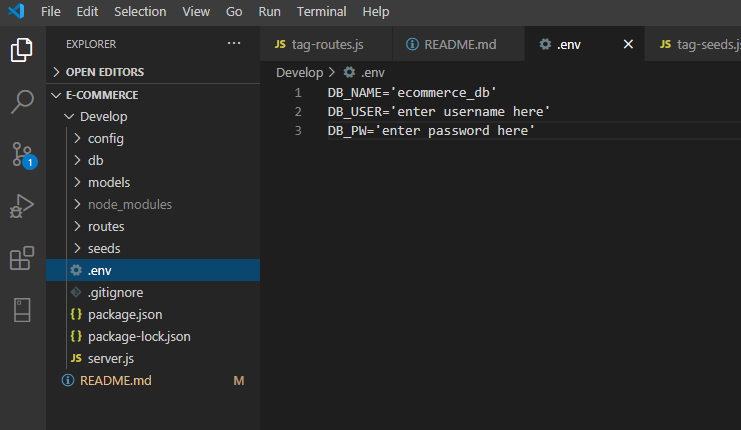
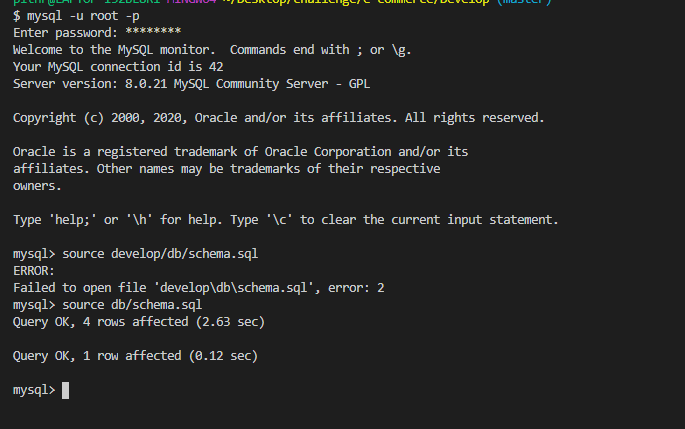
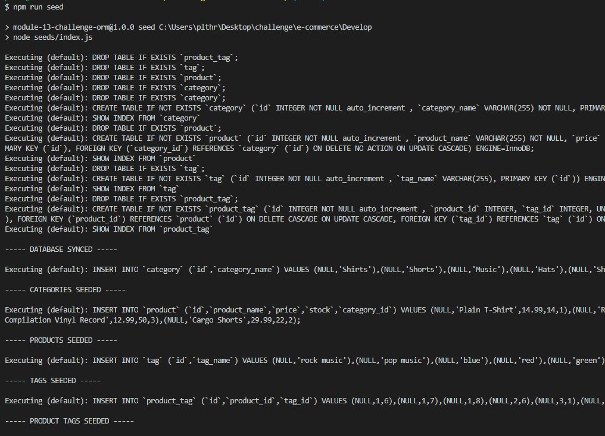
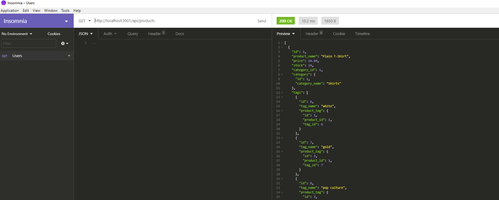

  # E-Commerce

  

  ## Description 

  This is a back end for an e-commerce website that uses the latest technologies so that the company can compete with other e-commerce companies. 
  
  
  ## Table of Contents
    
  * [Installation](#installation)
  * [Usage](#usage)
  * [License](#license)
  * [Tests](#tests)
  * [Questions](#questions)
  
  
  ## Installation

  Since this is a program that is run in the command line. The following items will need to be installed on your computer to access the information:
  * You will need to have Node.js installed on your computer. 
    * You can add Node.js by going to its website at https://nodejs.org/en/ and downloading the current version. 
  * In the program itself you will need to add the following packages from npm: 
    * mysql2 - go to https://www.npmjs.com/package/mysql2 and follow the installation instructions. 
    * sequelize - go to https://www.npmjs.com/package/sequelize and follow the installation instructions.
    * dotenv - got to https://www.npmjs.com/package/dotenv and follow the installation instructions. 
  
  
  
  ## Usage 
  
  Once the dependancies have been installed, you will need to create a .env file that will contain your database name, user name and password. 

  
  
  Then from the command line you will need to enter: mysql -u root -p. You will then be prompted to enter your password. Once your password has been confirmed you will then need to enter the following in the mysql command line: source db/schema.sql to initial the schema.sql (Important - make sure the terminal session was opened in the Develop folder). 

  
  
  To seed the database you will need to return to the terminal that holds your code, in my case VS Code.  Once you are in the program terminal enter npm run seed. This will seed the application. 

  
  
  From there you will need to open insomnia and then you can GET, POST, PUT and DELETE data in any of the following 3 catergories: Catergories, Products or Tags. 

  
  
  
  ## License
  
  MIT

  ## Tests
  
  See the video walkthrough for how to test and use this program: https://drive.google.com/file/d/18iEoqBJOSKnlFLlQGBADbJi-3KOIZG0Q/view  

  ## Questions
  For questions you can contact me here:
  * GitHub Username: https://github.com/siwel20/
  * email: plthrock@gmail.com
